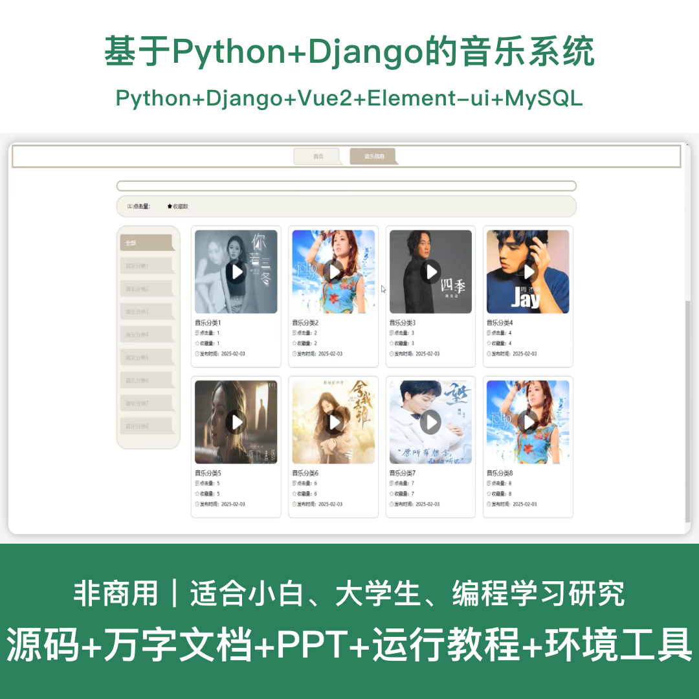
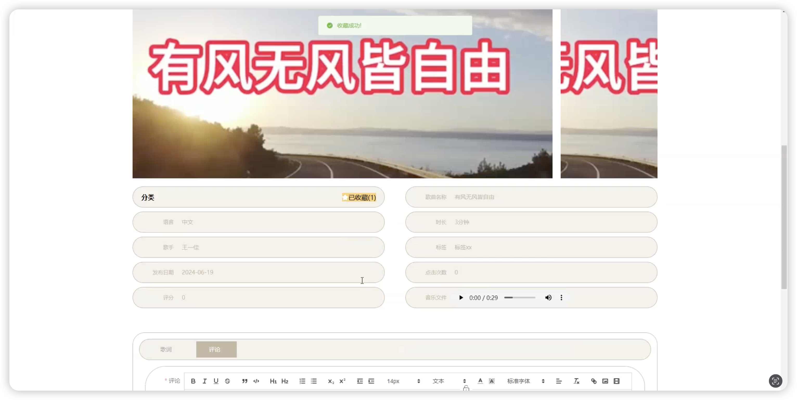
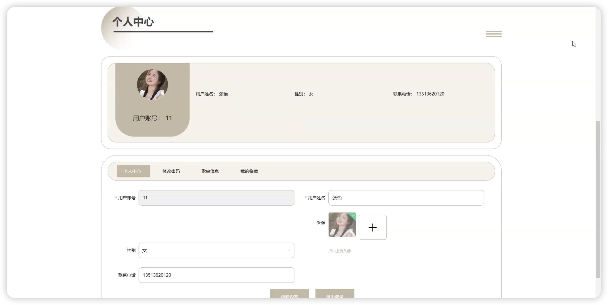
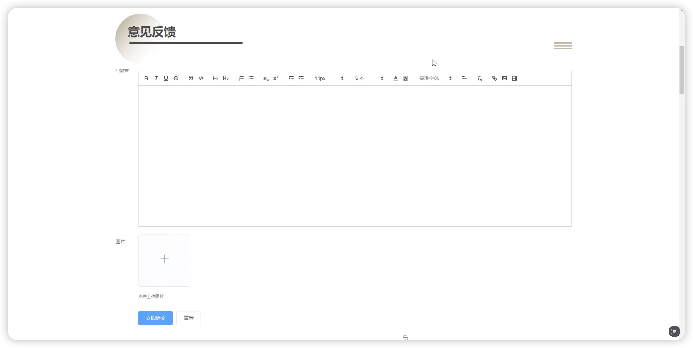
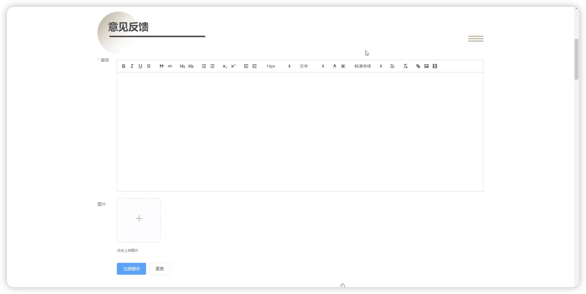
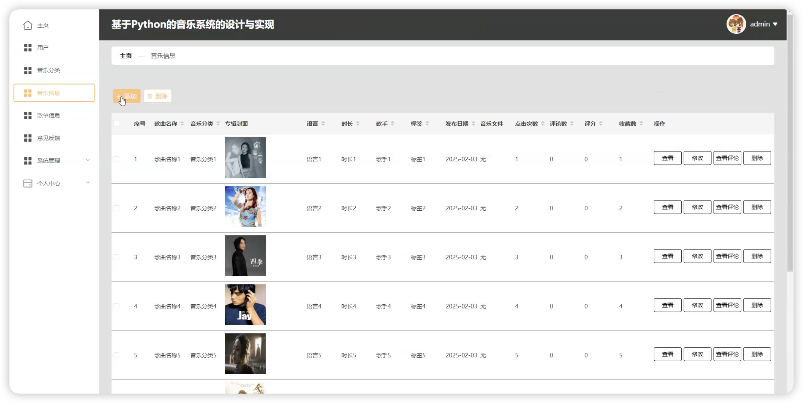
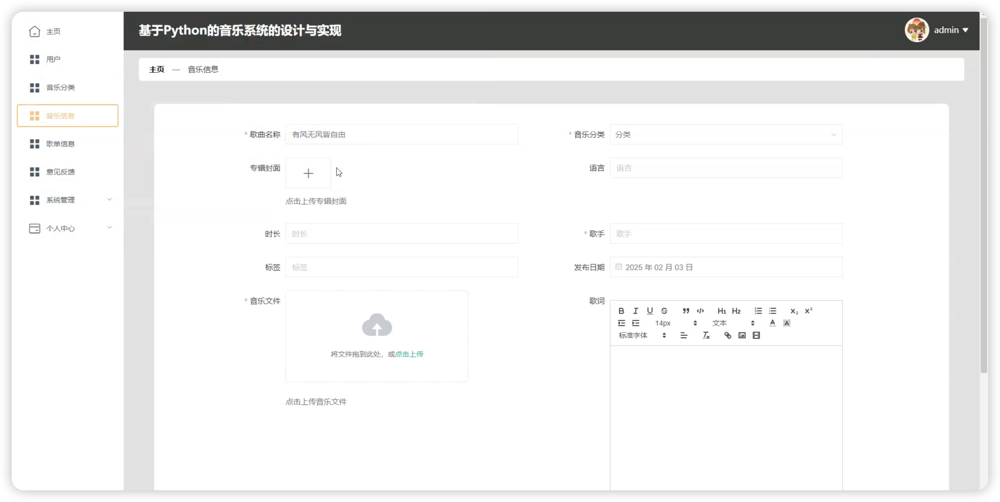
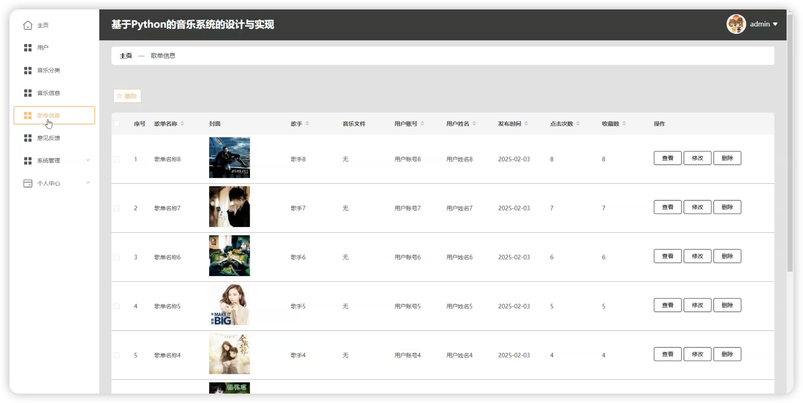

# python124D
python124D基于Python+Django的音乐系统+LW

## 源码问题查看主页咨询

### 一、关键词
音乐系统、在线音乐平台、音乐播放系统、音乐分享平台、音乐推荐系统

### 二、作品包含
源码+数据库+万字设计文档+PPT+全套环境和工具资源+本地部署教程

### 三、项目技术
前端技术：Html、Css、Js、Vue2.6、Element-ui
后端技术：Python、Django、PyMySQL

### 四、运行环境（以下版本亲测，其他版本兼容性请自行测试）
开发工具：PyCharm + VSCODE

数据库：MySQL 5.7+

数据库管理工具：Navicat10以上版本

环境配置软件：Python3.7+

前端Nodejs：14+

浏览器：谷歌浏览器

### 五、项目介绍
项目编号：python124D

基于Python+Django的音乐系统，为用户提供在线音乐播放、歌单管理、音乐分享等功能，提升音乐欣赏体验。

角色：管理员、用户

用户功能：注册登录、音乐浏览、音乐播放、歌单创建、歌单管理、音乐收藏、音乐评论、音乐分享、个人中心。

管理员功能：登录、用户管理、音乐信息管理、音乐分类管理、歌单信息管理、系统公告管理、留言管理、轮播图管理。

数据库表：13张

### 六、运行截图

